# WordMasterProject

## 2022-2 영단어장 만들기 프로젝트 [Part.1]

### 단어 보기

### 단어 추가
 

### 종료 
 

## 2022-2 영단어장 만들기 프로젝트 [Part.2]

### 프로그램 실행 및 파일에 저장된 데이터 불러오기
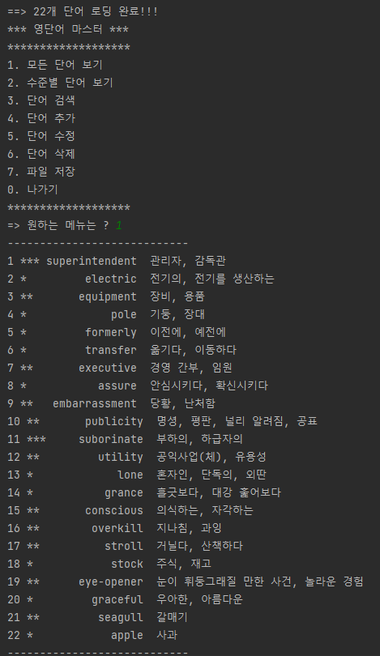 

### [2.수준별 단어 보기] 메뉴 실행
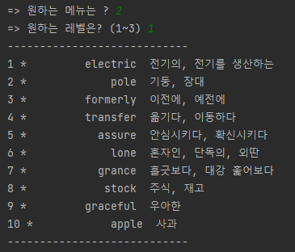 

### [3.단어검색] 메뉴 실행
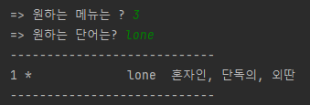 

### [5.단어수정] 메뉴 실행
1) graceful '우아한' -> graceful '우아한, 아름다운' 변경
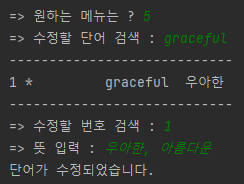 

2) 변경 결과를 [3.단어검색]을 통해 확인
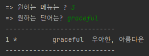 

### [6.단어 삭제] 메뉴 실행
1) 'apple 사과' 단어 삭제 
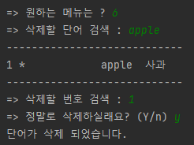

2) 삭제 후 변경 결과를 [3.단어 검색]을 통해 확인
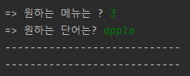 
변경 후 검색이 되지 않음을 확인 할 수 있었음

### [7.파일 저장] 메뉴 실행
1) 파일 원본 이미지 
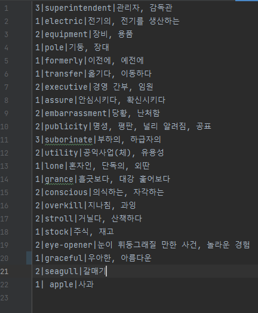 

2) 파일 저장 메뉴 실행
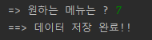 

3) 마지막 파일 저장 후 변경 된 내용 적용된 것을 확인
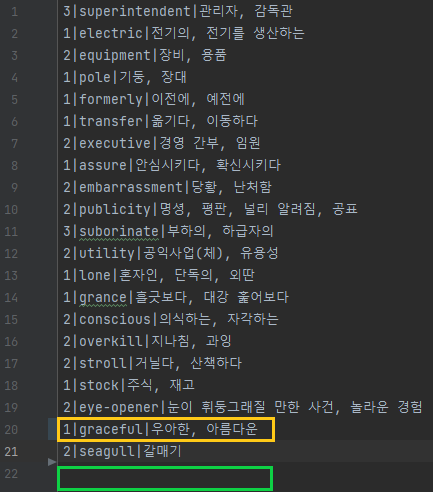

### 텍스트 파일 저장 위치 및 경로
1) 파일 위치 스크린샷
- 파일 이름 : Dictionary.txt
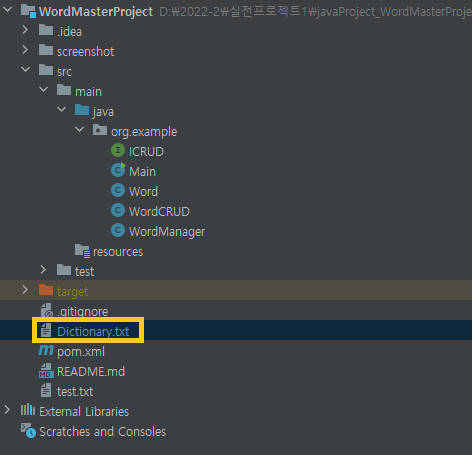 

2) 파일 경로 링크
- D:\2022-2\실전프로젝트1\javaProject_WordMasterProject\2022-2-Project\HelloProject_Starbucks\WordMasterProject\Dictionary.txt
